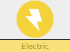

**Nickname:** \_\_\_\_\_\_\_\_\_\_\_\_\_\_\_\_\_\_\_\_\_\_\_\_\_\_\_\_\_\_\_\_

**Species:** \_\_\_\_\_\_\_\_\_\_\_\_\_\_\_\_\_\_\_\_\_\_\_\_\_\_\_\_\_\_\_\_\_\_

**Level** _\_\_\_\_   **Shiny:** ☐

 |   Super                        | Not Very| Not                         |
 |--------------------------------|---------|-----------------------------|
 | |   | |

### Description (Intel/Connections)

You're electric typing and being party of the chosen Pokemon gives you clout in the church of The Energizer. Electric type pokemon can see into the fabric of the universe allowing them to have multiple venues of getting intel. They can also hack computers!

Most of these moves require **Clever** or **Special**

### Stats

 |      Ability                   | Score | Moves that use ability                         |
 |--------------------------------|---------|-----------------------------|
 | **Cute**  | | Manipulate Someone   |
 | **Cool**  | | Act Under Pressure   Help Out |
 | **Clever**| | Investigate a Mystery   Read a Bad Situation |
 | **Tough** | | Normal Attacks   Protect Someone |
 | **Special** | | Special Attacks   |

**Luck**

Okay ☐☐☐☐☐☐☐ Doomed

**Harm**

Okay ☐☐☐|☐☐☐☐ Dying

Unstable: ☐

---

## Abilities

---

### ☒ Volt Absorb 
> When hit with an electric move, you heal harm instead of taking it.

---

## Actions

---
### ☒ Thunder

>You may seek the church of the energizer for advice  
>roll **+Clever**  

>10+ You get an answer to your question  
>7-9: You chose, you can't be helped, or you can but you owe the church a favor  
>Miss: your question causes some trouble  

### ☐ Eerie Impulse

>You can see into the fabric of existence it self and glimpse the essence of a Pokemon.  
>Roll **+Special**

>12+ hold 3  
>10+ hold 2  
>7-9: hold 1  
>Miss: you cause some type of glitch, keeper takes a hard move  

* Type  
* An attack (can be asked more then once)  
* Level and stats (Like if it has SPD or DF)  

### ☐  Electroweb

> When you hack into a computer system, roll  
> **+Clever**  

> 10+ pick two  
> 7-9: pick one.  

* leave no traces.
* learn something important.
* can leave misinformation in place.
* gain access to somewhere you want to get in to.

### ☐ Flash

> You can light up a dark cave (or other area)

### ☐ Thunder Wave

> You can use **Special** when making physical attacks

---

## Attacks

---

## ☒ Thunder

Roll at -1 **Special**  
If you roll a 10+ roll a d6. On a 1, 2, or 3 causes paralysis  
You can hit Pokemon in the semi-invulerable state of fly  

 | Type        | Category   | Damage      |
 | ----------- | ------------ | ----------- |
 |  | | 2 Harm|

---

### ☐ Quick Attack

If you hit with this attack, you may attack with this again in the same action.
Limit twice per action. Can not crit.

 | Type        | Category   | Damage      |
 | ----------- | ------------ | ----------- |
 | | | 1 Harm |

---

### ☐ Eerie Impulse

Does something...

 | Type        | Category   | Damage      |
 | ----------- | ------------ | ----------- |
 |  | | |

---
### ☐ Electroweb

 | Type        | Category   | Damage      |
 | ----------- | ------------ | ----------- |
 |  | | 1 Harm|

---

### ☐ Thunder Wave

Causes effected target to be paralyzed

 | Type        | Category   | Damage      |
 | ----------- | ------------ | ----------- |
 |  | | NA |

---

### ☐ Flash

For the rest of the battle, roll your attacks at +1 **Special** (Does not stack)

 | Type        | Category   | Damage      |
 | ----------- | ------------ | ----------- |
 |  | | |

---

### Type:  

 |   Super                      | Not Very | Not                                                          |
 |------------------------------|----------|--------------------------------------------------------------|
 |  |    |  |

### Type: 

 |   Super                        | Not Very| Not                         |
 |--------------------------------|---------|-----------------------------|
 | |         | |

---
