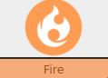

**Nickname:** \_\_\_\_\_\_\_\_\_\_\_\_\_\_\_\_\_\_\_\_\_\_\_\_\_\_\_\_\_\_\_\_

**Species:** \_\_\_\_\_\_\_\_\_\_\_\_\_\_\_\_\_\_\_\_\_\_\_\_\_\_\_\_\_\_\_\_\_\_

**Level** _\_\_\_\_   **Shiny:** ☐

 |   Super                                                                               | Not Very                                                                            | Not|
 |---------------------------------------------------------------------------------------|-------------------------------------------------------------------------------------|----|
 |   |    |    |

### Description (Damage Caster)

Burn baby burn disco inferno. Sort of a shoot first deal with the consequences later type of Pokemon. You can cause large amounts of damage and destruction but often at a cost.

They have big attacks that use **Special**, and can be weak to **Special Defense**. They can also be a bit of a bully, able to effectivly **Manipulate Someone** with **Tough**
 
### Stats

 |      Ability                   | Score | Moves that use ability                         |
 |--------------------------------|---------|-----------------------------|
 | **Cute**  | | Manipulate Someone   |
 | **Cool**  | | Act Under Pressure   Help Out |
 | **Clever**| | Investigate a Mystery   Read a Bad Situation |
 | **Tough** | | Normal Attacks   Protect Someone |
 | **Special** | | Special Attacks   |

**Luck**

Okay ☐☐☐☐☐☐☐ Doomed

**Harm**

Okay ☐☐☐|☐☐☐☐ Dying

Unstable: ☐

---

## Abilities 
Pick one extra abiliy during pokemon creation

---

### ☒ Burn Immune 
> You can not be burned.

### ☐ Reckless 
> +1 to **act under pressure** when dealing with the consequences of your class actions or attacks.

### ☐ Heatproof
> You are immune to fire (Your moves can still damage you)

### ☐ Slash

> +1 to rolls when using **Manipulate Someone**

---

## Actions

---

### ☐ Flamethrower (Requires having a fire type special attak)

> You can create fire in a controlled way (like to light a candle or burn down a house).

### ☐  Will-O-Wisp

> Use can use **Tough** instead of **Charm** to **Manipulate Someone**

### ☐ Smokescreen

> You can provide cover to hide or escape with

> rool +**Clever**

> 10+ Youre smokescreen covers what you want it to. Pokemon/Things inside of it can not be detected by normal means  
> 7-9 Youre smokescreen works, but perhaps there is some unwanted sideffect or it doesn't quite cover what you want  
> Miss keeper makes a hard move. Likely there is fire envolved some how  
---

## Attacks

---

### ☒ Flamethrower

 | Type        | Category   | Damage      |
 | ----------- | ------------ | ----------- |
 | | | 2 Harm |

Pick as many Benifits as you want. For each Benifit, you must pick a Drawback

### Benefits

☐ Deal +1 Harm

☐ Ignore **Sepcial Defense**

☐ Inflic burn on hit

☐ Attack up to 3 targets

### Drawbacks

☐ On a 7-9 You take 1 harm ignore **Special Defense**

☐ On a 7-9 deal one less harm

☐ Requires a sucessful **Act under Pressue** roll to use

☐ On a miss the keeper holds a hard move

---

### ☐ Wild Fire

  On a 7+ Creates a "fire wall" providing +1 **Defence**. When using physical attacks through the "fire wall" roll a d6, on a 1 or 2 inflicts burn.

  On a miss, this attack draws immediate, unwelcome attention.

 | Type        | Category   | Damage      |
 | ----------- | ------------ | ----------- |
 | | | 1 Harm |

### ☐ Firepunch

If this move hits, roll a d6. On a 1 or 2 the target is burned.

 | Type        | Category   | Damage      |
 | ----------- | ------------ | ----------- |
 | | | 1 Harm|

### ☐ Fiery Dance

For the rest of the battle, roll your attacks at +1 **Special** and  +1 to **Act Under Pressure** (Does not stack)

 | Type        | Category   | Damage      |
 | ----------- | ------------ | ----------- |
 | | | |

### ☐ Will-O-Wisp 

Causes target to be burned

 | Type        | Category   | Damage      |
 | ----------- | ------------ | ----------- |
 | | | NA |

### ☐ Slash

On a 10+ you may also take or give +1 forward.

 | Type        | Category   | Damage      |
 | ----------- | ------------ | ----------- |
 | | | 1 Harm |

---

### Type 

 |   Super                                                                           | Not Very                                                                                                           | Not|
 |-----------------------------------------------------------------------------------|--------------------------------------------------------------------------------------------------------------------|----|
 |   |     |    |

### Type 

 |   Super                        | Not Very| Not                         |
 |--------------------------------|---------|-----------------------------|
 | |         | |

---
