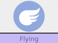
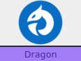

 

**Nickname:** \_\_\_\_\_\_\_\_\_\_\_\_\_\_\_\_\_\_\_\_\_\_\_\_\_\_\_\_\_\_\_\_

**Species:** \_\_\_\_\_\_\_\_\_\_\_\_\_\_\_\_\_\_\_\_\_\_\_\_\_\_\_\_\_\_\_\_\_\_

**Level** _\_\_\_\_   **Shiny:** ☐

### Description (Mobility)

**Flying/Dragon** Pokemon add a lot of maneuverability to a party. They can fly around scouting out an area and accessing places other Pokemon can’t. They also have the ability to escape some bad situations.

They require ***Cool*** to perform there daring aerial acrobatics. There most damaging attacks are physical, requiring ***Tough***. There  ***Special*** moves are particularly good at hitting semi invulnerable Pokemon.

### Stats

 |      Ability                   | Score | Moves that use ability                         |
 |--------------------------------|---------|-----------------------------|
 | **Cute**  | | Manipulate Someone   |
 | **Cool**  | | Act Under Pressure   Help Out |
 | **Clever**| | Investigate a Mystery   Read a Bad Situation |
 | **Tough** | | Normal Attacks   Protect Someone |
 | **Special** | | Special Attacks   |

**Luck**

Okay ☐☐☐☐☐☐☐ Doomed

**Harm**

Okay ☐☐☐|☐☐☐☐ Dying

Unstable: ☐

** Flying **

|   Super                        | Not Very| Not                         |
|--------------------------------|---------|-----------------------------|
|   |           | |

** Dragon **

|   Super                        | Not Very| Not                         |
|--------------------------------|---------|-----------------------------|
|   |     | |

---

### Abilities

---

### ☒ Flying 

> You can fly freely in reasonable conditions.

### ☐ Sturdy

> You have one extra Luck box

> You always take only 1 harm for the first source of harm when at full health. Even if the source would instantly kill you.

---

## Actions

---

### ☒ Fly

> You  can  go  instantly  to  anywhere  you've visited before, or to a pokemon you know well.  

> When you carry other poekmon rool **+Special**

> 10+ you all go where you wanted.  
>7-9: you don' t  quite  manage  it.  Either  you  are  all  separated, or you all appear in the wrong place  
>Miss: disaster strikes  

### ☐ Twister

> You can attempt to gust away a monster in a giant typhoon  
> Roll **+Tough**

>10+ You gust away the monster to some where that is not here!  
>7-9: it takes a while, the monster has a few turns to act  
>Miss: Something is keeping it here. That's bad...  

### ☐ Aerial Ace (Requires the ability to Fly)

> You can attempt to fly under any extreme condition (Assuming there is room to fly)

> rol **+Cool**

> 10+ You can fly freely as if conditions where ideal  
> 7-9: You fly with some trouble. Either you don't quite get to where you are going or it takes you a long time.  
> Miss: you fail fantastically and end up somewhere you don’t want to be  

### ☐ Acrobatics (Requires the ability to Fly)

> You can scout out an area that you can fly around

> roll **+Cool**

> 10+ hold 2
> 7-9: hold 1
> Miss: keeper holds a hard move

* Know where you need to be
* Get prepared and ready.

---

## Attacks

---

### ☒ Fly

Your opponent takes two moves against you. However for the first one you are semi- invulnerable (You could still be hit by swift for example).

| Type        | Category   | Damage      |
| ----------- | ------------ | ----------- |
| | | 2 Harm |

---

### ☐ Dragon Dance 

Your next attack deals +1 harm

| Type        | Category   | Damage      |
| ----------- | ------------ | ----------- |
| | | NA |

---

### ☐ Aerial Ace (Requires the ability to Fly)

| Type        | Category   | Damage      |
| ----------- | ------------ | ----------- |
| | | 1 Harm |

---

### ☐ Brave Bird

Take one harm whenever you use this move 

| Type        | Category   | Damage      |
| ----------- | ------------ | ----------- |
| | | 3 Harm |

---

### ☐ Acrobatics (Requires the ability to Fly)

On a 10+ you can move the target where you want to

| Type        | Category   | Damage      |
| ----------- | ------------ | ----------- |
| | | 1 Harm |

---

### ☐ Quick Attack

If you hit with this attack, you may attack with this again in the same action. 
Limit twice per action. Can not crit.

| Type        | Category   | Damage      |
| ----------- | ------------ | ----------- |
| | | 1 Harm |

---

### ☐ Twister

Roll a d6, on a 1 the target flinches.

Can hit semi-invulnerable Pokemon and deals +1 Harm to them.

| Type        | Category   | Damage      |
| ----------- | ------------ | ----------- |
| | | 1 Harm |

---

### Type 

|   Super                        | Not Very| Not                         |
|--------------------------------|---------|-----------------------------|
|   |   | |

### Type 

|   Super                        | Not Very| Not                         |
|--------------------------------|---------|-----------------------------|
| |         | |

### Type 

|   Super                        | Not Very| Not                         |
|--------------------------------|---------|-----------------------------|
|  | |

---
