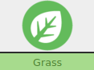
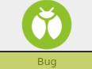

 

### Description (Generalist)

**Grass** and **Bug** Pokemon are kind of a mixed bag. There are alot of options, but perhaps nothing too single foucused. They also have by far the best status effect move. 

**Grass** pokemon can have amazing survivability if they have a source of healing. **Bug** pokemon are good at finding hiden things and have better crits.

They use **Tough** to precisely cut and also move Pokemon around where they want them. Also **Cool** can be used for good first impressions

### Stats

 |      Ability                   | Score | Moves that use ability                         |
 |--------------------------------|---------|-----------------------------|
 | **Cute**  | | Manipulate Someone   |
 | **Cool**  | | Act Under Pressure   Help Out |
 | **Clever**| | Investigate a Mystery   Read a Bad Situation |
 | **Tough** | | Normal Attacks   Protect Someone |
 | **Special** | | Special Attacks   |

**Luck**

Okay ☐☐☐☐☐☐☐ Doomed

**Harm**

Okay ☐☐☐|☐☐☐☐ Dying

Unstable: ☐

## Grass 

### Effective

 |   Super                                                                                                                                      | Not Very                                                                                                                | Not|
 |----------------------------------------------------------------------------------------------------------------------------------------------|-------------------------------------------------------------------------------------------------------------------------|----|
 |     |     |    |

### Ability

**Chlorophyll:** Any time your harm gets healed, heal an extra point. Additionally you can never be unstable in full sunlight.

## Bug 

### Effective

 |   Super                                                                                                                                      | Not Very                                                                                                                | Not|
 |----------------------------------------------------------------------------------------------------------------------------------------------|-------------------------------------------------------------------------------------------------------------------------|----|
 |    |        ||

### Ability

**Compound Eyes:** The keeper will alert you if you are close to something hidden (such as an item or a secret room)

** Sniper:** Your Crits deal +2 Harm instead of +1

---

# Moves

---

## *Cut

  | Type        | Category   | Damage      |
 | ----------- | ------------ | ----------- |
 | | | 1 Harm |

### Efective

 |   Super                        | Not Very| Not                         |
 |--------------------------------|---------|-----------------------------|
 | |         | |

### Move

You can cut through plants, tall grass, and some objects. You can also climb trees via a cut glitch.

You can also attempt to cut through more sturdy things, like a brick wall.

Roll + **Tough**

10+ You instantly Destroy what ever you where trying to cut down

7-9: You severely weaken what you are trying to cut down, but it takes a while to complete. This could draw unwanted attention in some situations.

Miss: You fail to destroy what you are cutting and draw unwanted attention immediately

---

## Leech life

| Type        | Category   | Damage      |
| ----------- | ------------ | ----------- |
| | | 1 Harm |

When you hit with this attack heal 1

### Effective

 |   Super                        | Not Very| Not                         |
 |--------------------------------|---------|-----------------------------|
 |   |      | |

---

## Sleep powder

 | Type        | Category   | Damage      |
 | ----------- | ------------ | ----------- |
 | | | NA |

Causes effected target be put to sleep

### Passive

You may use ***Tough*** instead of ***Cool*** to **Act under pressure**

---

## Vine Whip

| Type        | Category   | Damage      |
| ----------- | ------------ | ----------- |
| | | 1 Harm |

On a hit move the monster you are attacking where you want it.

### Effective

 |   Super                        | Not Very| Not                         |
 |--------------------------------|---------|-----------------------------|
 |   |       | |

### Move

You can grab any Pokemon or object (10 lbs or less) up to 30 ft away to move, lift, throw or grapple it.

---

## Hyper Beam

 | Type        | Category   | Damage      |
 | ----------- | ------------ | ----------- |
 | | | 3 Harm |

Your opponent takes two moves against you.

### Effective

 |   Super                        | Not Very| Not                         |
 |--------------------------------|---------|-----------------------------|
 | |         | |

---

## First Impression

 | Type        | Category   | Damage      |
 | ----------- | ------------ | ----------- |
 | | | 1 |

Only works on the first turn of combat.

You opponent does not get a move this turn.

### Effective

 |   Super                        | Not Very| Not                         |
 |--------------------------------|---------|-----------------------------|
 |   |      | |

### Move

When you first meet a non legendary Pokemon, that doesn't already know who you are, you may roll **+Cool**

10+: They are immediately friendly to you and will be more likely to help you out

7-9: They are friendly too you but will not necessarily help you out for no reason

Miss: They don't like you at all and will likely not help you with out a lot of convincing
