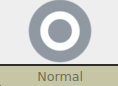

**Nickname:** \_\_\_\_\_\_\_\_\_\_\_\_\_\_\_\_\_\_\_\_\_\_\_\_\_\_\_\_\_\_\_\_

**Species:** \_\_\_\_\_\_\_\_\_\_\_\_\_\_\_\_\_\_\_\_\_\_\_\_\_\_\_\_\_\_\_\_\_\_

**Level** _\_\_\_\_   **Shiny:** ☐

 |   Super                        | Not Very| Not                         |
 |--------------------------------|---------|-----------------------------|
 | |         | |

### Description (Support)

While at first glance, normal Pokemon are the model support type Pokemon. However they have the ability to pick a move from any playbook, giving them a little flavor of what ever they want to be! They also have no required move, giving them more flexibility.

**Cute** is prominently featured in there abilities. Otherwise it depends on what move they happen to take from another playbook.

### Stats

 |      Ability                   | Score | Moves that use ability                         |
 |--------------------------------|---------|-----------------------------|
 | **Cute**  | 1 | Manipulate Someone   |
 | **Cool**  | 1 | Act Under Pressure   Help Out |
 | **Clever**| 1 | Investigate a Mystery   Read a Bad Situation |
 | **Tough** | 0 | Physical Attacks   Protect Someone |
 | **Special** | 0 | Special Attacks   |

**Luck**

Okay ☐☐☐☐☐☐☐ Doomed

**Harm**

Okay ☐☐☐|☐☐☐☐ Dying

Unstable: ☐

---

## Abilities

---

### ☐  Dauntless Special Shield
> You have 2 **Special Defense**. Does not stack with other sources of **Special Defense**

### ☐ Healer
> +1 to rolls when using **Help Out** or **Wish**

---

## Actions

---

### ☒  Mimic 

> You may take one action (excludes moves that are checked by default) from another playbook. You still need to meet the requirements to take that action.

.  
.  
.  
.  
.  

### ☐ Sing

> Roll **+Cute**.

> 10+ everyone stops to watch and listen until you finish your singing.  
> 7-9: you pick one Pokemon to stop, watch and listen until you finish singing.  
> Miss: you're singing draws unwanted attention  

> Does not effect legendary Pokemon

### ☐ Wish

> Your  touch  can  heal  injury  and  status effects.

> Roll **+Cute**

> 10+ heal 2 harm or a status effect, plus  they’re  stabilized.  
> 7-9: you can heal the harm or status effect as on a 10+, but you take it into your-self.  
> Miss: your aura causes 1 harm.  

---

## Attacks
---

### ☒  Mimic 

> You may take one attack (excludes moves that are checked by default) from another playbook. You still need to meet the requirements to take that attack.

 | Type        | Category   | Damage      |
 | ----------- | ------------ | ----------- |
 | ? | ? | ? |

### ☐ Reflect

> Roll to **protect someone** and Gain 2 **Defense** against any harm that is transferred to you.  
> Does not stack with other **Defense**

 | Type        | Category   | Damage      |
 | ----------- | ------------ | ----------- |
 | | | NA |

### ☐ Metronome

 > Roll A flat 2d6

 > On a 12, Pick any attack (excluding attacks that are checked by default) from a Pokemon starting playbook. Use that move as if you rolled a 12.  
 > On an 11 do a 2 Harm attack with a random type; randomly physical or special  
 > On a 10 you make a random party member immune to status effects for the duration of the encounter  
 On a 9 You may inflict a random status effect  
 On an 8 you create a random weather condition  
 On a 7 you do 1 harm attack with a random type; randomly physical or special  
 On a 6 you become confused  
 On a 5 you become poisoned  
 On a 4 you are asleep  
 On a 3 you use Fling  
 On a 2 you use self destruct. Deal 8 harm to the target and everyone in a 10 foot radius. You are dead.  

 | Type        | Category   | Damage      |
 | ----------- | ------------ | ----------- |
 | | | 0 to 8 Harm?|

### ☐ Helping Hand

  > On a hit, give +1 forward to another Pokemon.

 | Type        | Category   | Damage      |
 | ----------- | ------------ | ----------- |
 | | | 1 Harm |

.  
.  
.  

### ☐ Rest

> You are asleep  
> Heal 2 harm

 | Type        | Category   | Damage      |
 | ----------- | ------------ | ----------- |
 | | | NA |

### ☐ Celebrate

> Congratulate someone on their special day!

 | Type        | Category   | Damage      |
 | ----------- | ------------ | ----------- |
 | | | NA |

---

###  Type 

 |   Super                        | Not Very| Not                         |
 |--------------------------------|---------|-----------------------------|
 | |         | |
