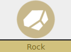

 

**Nickname:** \_\_\_\_\_\_\_\_\_\_\_\_\_\_\_\_\_\_\_\_\_\_\_\_\_\_\_\_\_\_\_\_

**Species:** \_\_\_\_\_\_\_\_\_\_\_\_\_\_\_\_\_\_\_\_\_\_\_\_\_\_\_\_\_\_\_\_\_\_

**Level** _\_\_\_\_   **Shiny:** ☐

### Description (Physical Attacker)

Do you just want to punch things really hard? Well then look no further. **Rock** and **Fighting** Pokemon must beware of **Ghost** Pokemon, as they may have a hard time hitting them. Also there biggest attacks are physical, so they can have problems with **Special Defense** if they don't take **Ancient Power.**

All you need is **Tough** to punch all the things! **Clever** can be used with **Ancient Power**

**Rock** Pokemon have a bit more survivability while **Fighting** Pokemon can hit things even harder.

### Stats

 |      Ability                   | Score | Moves that use ability                         |
 |--------------------------------|---------|-----------------------------|
 | **Cute**  | -1| Manipulate Someone   |
 | **Cool**  | 0| Act Under Pressure   Help Out |
 | **Clever**| 1 | Investigate a Mystery   Read a Bad Situation |
 | **Tough** | 2| Physical Attacks   Protect Someone |
 | **Special** | 1 | Special Attacks   |

**Luck**

Okay ☐☐☐☐☐☐☐ Doomed

**Harm**

Okay ☐☐☐|☐☐☐☐ Dying

Unstable: ☐

### Rock

 |   Super                        | Not Very| Not                         |
 |--------------------------------|---------|-----------------------------|
 |    |    | |

### Fighting

 |   Super                        | Not Very| Not                         |
 |--------------------------------|---------|-----------------------------|
  |    |    | |

---

### Abilities:

---

### 

### ☒ Dauntless Shield 
> You have 2 **Defense**. Does not stack with other sources of **Defense**

### 

### ☐ Signature Move 
> Pick a physical move. You roll at +1 tough or special when attacking with that move.

### ☐ What Does Not Kill Me... 
> If you have suffered harm in a fight, you gain +1 ongoing until the fight is over.

---

## Actions

---

### ☒ Strength

> You can move heavy things like boulders.

> You can try to move something up to 7 tons (A really heavy elephant)  
> 
> Roll + **Tough**  

> 10+ You can move and carry it no problem  
> 7-9: It takes a while, to move and you may not be able to move it exactly where you want it  
> Miss: You can not move it and the keeper holds a hard move  

### ☐ Revenge

> Pick a Pokemon type during Pokemon creation

> You get +1 ongoing when knowingly investigating, pursuing or fighting a Pokemon of that type.

### ☐ Rollout

> When you charge into a dangerous situation

> Roll **+Tough**

> 12+: Hold 3  
> 10+: Hold 2  
> 7-9: Hold 1  
> Miss: Your charging into a dangerous situation doesn't work out so well  

* Inflict +1 harm on your first attack
* Reduce some ones harm by 1
* take +2 forward on act under pressure

### ☐ Ancient Power

> Once per mystery, you can attempt to keep going despite your injuries.

> Roll **+Clever**

> 10+ heal 2 and stabilize  
> 7-9: stabilize or heal one  
> 6 - you take one harm or become unstable (keepers choice)  

---
### Attacks
---

### ☒ Strength

On a +10, you can move pokemon you are attacking where you want.

  | Type        | Category   | Damage      |
 | ----------- | ------------ | ----------- |
 | | | 2 Harm |

### ☐ Revenge

You opponent moves first. If they do not deal damage, this attack automatically misses.

 | Type        | Category   | Damage      |
 | ----------- | ------------ | ----------- |
 | | | 3 Harm |

.  
.  
.  

### ☐ Close Combat

You lose 1 **Defense** for the rest of the combat. Can not use if you do not have at least 1 **Defense**

 | Type        | Category   | Damage      |
 | ----------- | ------------ | ----------- |
 | | | 3 Harm |

### ☐ High Jump Kick

If you miss, take 1 damage (Ignore **Defense**)

 | Type        | Category   | Damage      |
 | ----------- | ------------ | ----------- |
 | | | 3 Harm |

### ☐ Rollout

You can use this move no mater how much harm you have taken (even if you have feinted)

 | Type        | Category   | Damage      |
 | ----------- | ------------ | ----------- |
 | | | 1 Harm |

### ☐ Ancient Power

You gain 1 **Defense** (Max 2) for the rest of the combat

 | Type        | Category   | Damage      |
 | ----------- | ------------ | ----------- |
 | | | 2 Harm |

---

### Type 

 |   Super                        | Not Very| Not                         |
 |--------------------------------|---------|-----------------------------|
 | |         | |

### Type 

 |   Super                        | Not Very| Not                         |
 |--------------------------------|---------|-----------------------------|
 |     |   | |

### Type 

 |   Super                        | Not Very| Not                         |
 |--------------------------------|---------|-----------------------------|
 |   |            |  |
