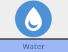

**Nickname:** \_\_\_\_\_\_\_\_\_\_\_\_\_\_\_\_\_\_\_\_\_\_\_\_\_\_\_\_\_\_\_\_

**Species:** \_\_\_\_\_\_\_\_\_\_\_\_\_\_\_\_\_\_\_\_\_\_\_\_\_\_\_\_\_\_\_\_\_\_

**Level** _\_\_\_\_   **Shiny:** ☐

 |   Super                      | Not Very                                                 | Not                                                           |
 |------------------------------|----------------------------------------------------------|---------------------------------------------------------------|
 |   |   | |

### Description (Tinkerer)

Water Pokemon can asses, use, and create items! They start with a pokebag allowing them to have up to 3 items at a time! They can also swim and breath underwater and heal status effects.

They use **Clever** to navigate the open seas as well as identifying items
### Stats

 |      Ability                   | Score | Moves that use ability                         |
 |--------------------------------|---------|-----------------------------|
 | **Cute**  | 1 | Manipulate Someone   |
 | **Cool**  | 0 | Act Under Pressure   Help Out |
 | **Clever**| 2 | Investigate a Mystery   Read a Bad Situation |
 | **Tough** | 1 | Physical Attacks   Protect Someone |
 | **Special** | -1 | Special Attacks   |

**Luck**

Okay ☐☐☐☐☐☐☐ Doomed

**Harm**

Okay ☐☐☐|☐☐☐☐ Dying

Unstable: ☐

### Starting Item

Pokebag (Does not count as a held item) - You can hold 2 extra items in your pokebag. As a move you may exchange an item in your pokebag with your held item.

---
## Ablilities  
---

### ☐ Razor Shell  
> When attacked the attacker takes +1 harm if using a physical attack  
### ☐ Recycle  
> Once per mystery, you may reuse a consumed item  

---

## Actions

---

### ☒ Surf

> You can swim on any body of water and dive under water.  
> If you want to bring other Pokemon rool **+Clever**  

>10+: You all go where you wanted.  
7-9: You don’t quite manage it. Either you are all separated, or you all appear in the wrong place.  
Miss: disaster strikes.  

### ☐ Liquidation

> You are a seasoned veteran of surplus auctions  
When evaluating or identifying an item roll **+Clever**  

>10 +: You know exactly what the item does and how much it is worth  
7-9: You partially know what the item does and have an idea about its worth  
miss: You know nothing about the item

>Can be used to identify a hostile Pokemon's held item  
You also get +1 on rolls to **Manipulate Someone** when trying to mask the effect or value of an item

### ☐ Crabhammer

> You can craft items with your crabhammer  
**Once per mystery**, After 1 hour of uninterrupted work you can craft one of the items on the list.  
If this is the first mystery, you can elect to start with one of these items instead.  

* Assault Vest: +1 Special Defense (Max +2).  
* Power Belt: +1 Defense (Max +2).  
* Razor Claw: When you crit you also take -1 harm.  
* Safety Goggles: Grants the holder immunity to powder and spore moves and immunity to damage from hail and sandstorm.  
* Poke Doll: Consume item to escape instantly.  
* Iron Ball: Holder always acts second and is susceptible to ground type moves, even when normally immune.  
* Tin of Beans: Useful for cooking!

### ☐ Create Water  
> You create up to 10 gallons of clean water  

---
## Attacks
---

## ☒ Surf

 | Type        | Category   | Damage      |
 | ----------- | ------------ | ----------- |
 | | | 1 Harm |

10+: you can deal 1 Harm to all enemies in a fight.

7-9: you can deal 1 Harm to all enemies in a fight. You also deal damage to your 2 closets allies.

Miss: You only damage your two closets allies.

### Effective

 |   Super                                                                           | Not Very                                                                                                           | Not|
 |-----------------------------------------------------------------------------------|--------------------------------------------------------------------------------------------------------------------|----|
 |   |    |    |

---

## ☐ Razor Shell

 | Type        | Category   | Damage      |
 | ----------- | ------------ | ----------- |
 | | | 1 Harm |

You have +1 **Defense** (Max +2) until your next turn.

### Effective

 |   Super                                                                           | Not Very                                                                                                           | Not|
 |-----------------------------------------------------------------------------------|--------------------------------------------------------------------------------------------------------------------|----|
 |   |    |    |

---

## ☐ Liquidation

 | Type        | Category   | Damage      |
 | ----------- | ------------ | ----------- |
 | | | 1 Harm |

Ignores Defense

### Effective

 |   Super                                                                           | Not Very                                                                                                           | Not|
 |-----------------------------------------------------------------------------------|--------------------------------------------------------------------------------------------------------------------|----|
 |   |    |    |

---

## ☐ Crabhammer

 | Type        | Category   | Damage      |
 | ----------- | ------------ | ----------- |
 | | | 1 Harm |

Roll with +1 **Tough**

### Effective

 |   Super                                                                           | Not Very                                                                                                           | Not|
 |-----------------------------------------------------------------------------------|--------------------------------------------------------------------------------------------------------------------|----|
 |   |    |    |

---

## ☐ Haze

 | Type        | Category   | Damage      |
 | ----------- | ------------ | ----------- |
 | | | |

Remove all status effects from everyone in an encounter  
Also creates an obscuring mist.

---

## ☐ Ice Punch

 | Type        | Category   | Damage      |
 | ----------- | ------------ | ----------- |
 | | | 1 harm |

If this move hits, roll a d6. On a 1 the target is frozen.

### Effective

 |   Super                                                                           | Not Very                                                                                                           | Not|
 |-----------------------------------------------------------------------------------|--------------------------------------------------------------------------------------------------------------------|----|
 |    |   |    |